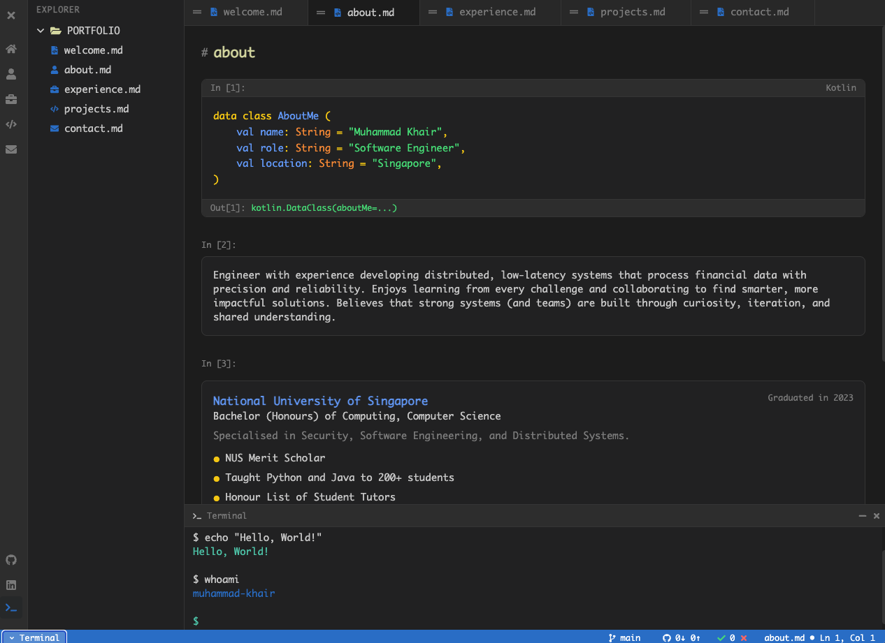

# Portfolio - VS Code Themed

A modern, interactive portfolio website styled like Visual Studio Code. Built with Next.js, TypeScript, Tailwind CSS, and Framer Motion.



## Features

- **VS Code-inspired UI** - Full IDE-like experience with activity bar, sidebar, tabs, editor, and status bar
- **Interactive tabs** - Drag-and-drop tab reordering, closeable tabs
- **Jupyter notebook-style code blocks** - Syntax-highlighted content in Kotlin style
- **Collapsible terminal** - Integrated terminal with typing animation
- **Responsive design** - Works on desktop and mobile
- **Dark theme** - VS Code Dark+ color scheme

## Tech Stack

- **Next.js 13** - App Router with static export
- **TypeScript** - Type-safe components
- **Tailwind CSS** - Utility-first styling
- **Framer Motion** - Smooth animations
- **@dnd-kit** - Drag and drop for tabs

## Project Structure

```
├── app/
│   ├── components/
│   │   ├── ActivityBar.tsx    # Left icon bar
│   │   ├── SideBar.tsx        # File explorer
│   │   ├── TabsBar.tsx       # Draggable tabs
│   │   ├── StatusBar.tsx     # Bottom status bar
│   │   ├── Terminal.tsx       # Collapsible terminal
│   │   ├── VSCodeLayout.tsx   # Main layout
│   │   └── tabs/              # Tab content components
│   │       ├── WelcomeTab.tsx
│   │       ├── AboutTab.tsx
│   │       ├── ExperienceTab.tsx
│   │       ├── ProjectsTab.tsx
│   │       └── ContactTab.tsx
│   ├── data/                  # Content data
│   │   ├── profile.ts        # Profile & skills
│   │   ├── experience.ts      # Work experience
│   │   └── projects.ts       # Portfolio projects
│   ├── layout.tsx
│   ├── page.tsx
│   └── globals.css
├── public/images/              # Project screenshots
├── tailwind.config.ts
├── next.config.js
└── package.json
```

## Getting Started

```bash
# Install dependencies
npm install

# Start development server
npm run dev

# Build for production
npm run build
```

The built files will be in the `out/` directory, ready for deployment to GitHub Pages.

## Deployment

This project is configured for GitHub Pages deployment. The workflow automatically:
- Builds on every push to any branch
- Deploys to GitHub Pages when pushing to main branch

## Customization

### Profile Data

Edit `app/data/profile.ts`:
- Name, role, and bio
- Skills (categorized as language, database, or infrastructure)
- Education history
- Social links (LinkedIn, GitHub, email)

### Experience

Edit `app/data/experience.ts`:
- Company name and logo
- Position and duration
- Description and skills used

### Projects

Edit `app/data/projects.ts`:
- Project name and description
- Screenshot image
- Technology badges
- Links to repository/demo

## Color Scheme

The VS Code theme colors are defined in `tailwind.config.ts`:
- Background: `#1e1e1e`
- Sidebar: `#252526`
- Activity Bar: `#333333`
- Status Bar: `#007acc` (VS Code blue)
- Accent colors for syntax highlighting

## License

MIT License - Feel free to use this template for your own portfolio.
