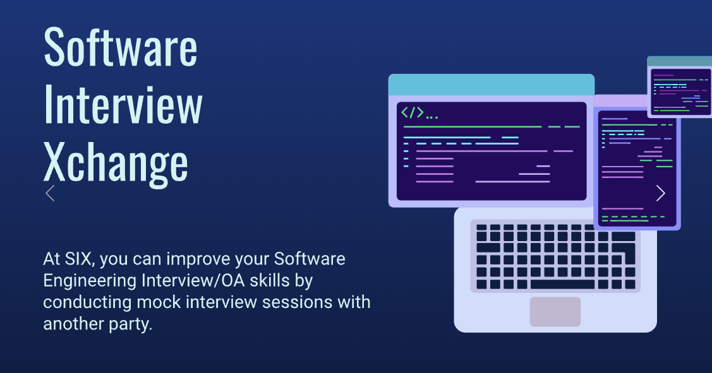
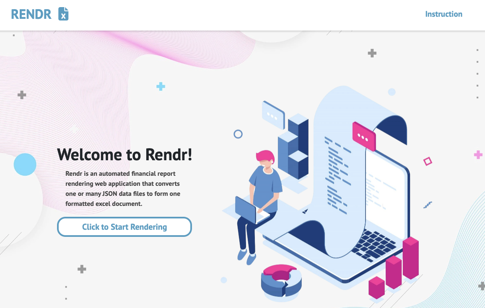
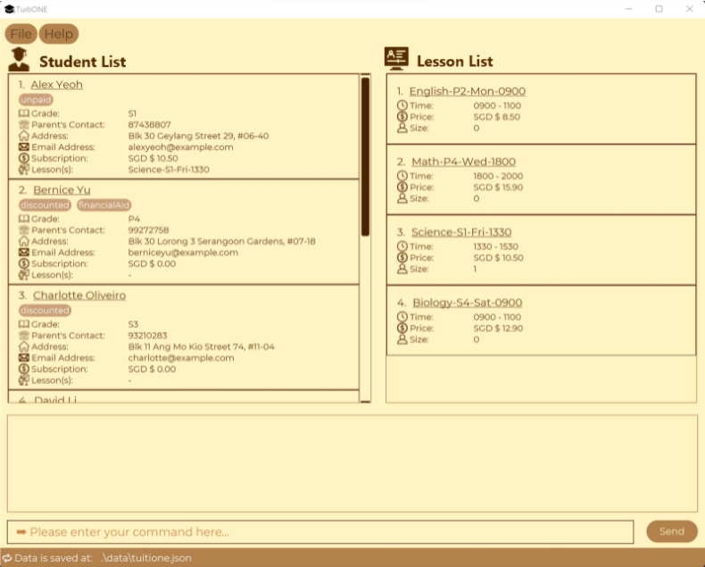

## Software Interview Xchange
Collaboration service for those in the technology domain to practice their technical and communication skills through practicing LeetCode questions
- 
- Tags: Collaborative Learning
- Badges:
  - Javascript [teal]
  - Express [teal]
  - React [teal]
  - Python [teal]
  - FastAPI [teal]
  - MongoDB [green]
  - MySQL [green]
  - Docker [orange]
- Buttons:
  - Explore [https://github.com/CS3219-AY2223S1/cs3219-project-ay2223s1-g4]

## Rendr
Regional champion solution for Customisable Report Rendering Problem Statement in Goldman Sachs' ENGage 2021
- 
- Tags: Financial Services
- Badges:
  - Java [teal]
  - Springboot [teal]
  - Javascript [teal]
  - React [teal]
  - Python [teal]
  - MySQL [green]
  - Docker [orange]
- Buttons:
  - Explore [https://github.com/MJKR-Tech/Rendr]

## TuitiONE
Tuition management application for customer service officers
- 
- Tags: Application
- Badges:
  - Java [teal]
  - JavaFX [teal]
- Buttons:
  - Explore [https://ay2122s1-cs2103t-f13-4.github.io/tp/]